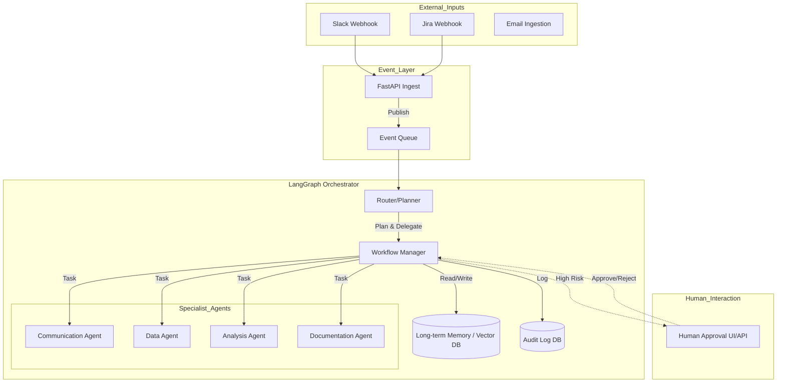

# Technical Implementation Plan: Autonomous Enterprise Workflow Agent

## 1. Project Summary
**Goal**: Build a production-grade, autonomous agent capable of orchestrating complex enterprise business workflows. The agent will monitor communication channels (Slack, Jira), plan executions, delegate tasks to specialized sub-agents, and maintain a complete, immutable audit trail.
**Value Proposition**: Automation of high-level cognitive business processes with human-in-the-loop oversight, reducing operational overhead while ensuring compliance and reliability through self-healing mechanisms and detailed observability.

## 2. Technical Architecture & Stack

### Stack Selection
*   **Language**: **Python 3.11+** (Standard for AI/Agentic development).
*   **Orchestration Framework**: **LangGraph** (Stateful, cyclic multi-agent orchestration, perfect for "human-in-the-loop" and complex state management).
*   **LLM Interface**: **LangChain** (Unified interface for model interaction).
*   **API Framework**: **FastAPI** (High-performance, async support for event handling).
*   **Database**: **PostgreSQL** (with `pgvector` for memory/RAG) + **Redis** (Hot state/caching).
*   **Queue/Event Bus**: **RabbitMQ** or **Redis Streams** (Decoupling event ingestion from processing).
*   **Observability**: **OpenTelemetry** + **LangSmith** (Tracing LLM calls).
*   **Containerization**: **Docker** & **Docker Compose** (Isolation and reproducibility).

### Architecture Diagram (Mermaid)



### Data Schemas

```python
from pydantic import BaseModel, Field
from typing import List, Optional, Dict, Any
from datetime import datetime
from enum import Enum

class EventSource(str, Enum):
    SLACK = "slack"
    JIRA = "jira"
    EMAIL = "email"

class WorkflowStatus(str, Enum):
    PENDING = "pending"
    PLANNING = "planning"
    RUNNING = "running"
    WAITING_FOR_APPROVAL = "waiting_for_approval"
    COMPLETED = "completed"
    FAILED = "failed"

class AgentAction(BaseModel):
    agent_name: str
    tool_name: str
    tool_input: Dict[str, Any]
    timestamp: datetime = Field(default_factory=datetime.now)

class AuditLogEntry(BaseModel):
    workflow_id: str
    action: AgentAction
    outcome: str
    authorized_by: Optional[str]

class WorkflowState(BaseModel):
    """Core state object passed through LangGraph"""
    workflow_id: str
    source: EventSource
    original_request: str
    plan: List[str]
    current_step_index: int
    context: Dict[str, Any]
    status: WorkflowStatus
    errors: List[str]
    audit_trail: List[AuditLogEntry]
```

### Architecture Mapping
*   **Event-driven architecture**: Handled by FastAPI ingestion endpoints pushing to Redis/RabbitMQ.
*   **Workflow orchestration**: Implemented via LangGraph `StateGraph`.
*   **Multi-agent delegation**: Nodes in the LangGraph graph representing `Specialist Agents`.
*   **Self-healing**: Retry policies in LangGraph nodes; "Supervisor" node for escalation.
*   **Audit trail**: Middleware or explicit steps in the graph to write to PostgreSQL `audit_logs` table.
*   **RBAC**: Middleware in FastAPI and checks within the `Manager` agent before execution.
*   **Observability**: LangSmith integration for traces; Prometheus/Grafana for high-level metrics.

## 3. Detailed Implementation Plan

### Phase 1: Foundation & Event Ingestion
**Goal**: Set up the project structure, Docker environment, database, and basic event ingestion pipeline.
**File Structure**:
```
src/
├── core/
│   ├── config.py
│   └── database.py
├── api/
│   ├── main.py
│   └── routes/
│       └── ingest.py
├── services/
│   └── queue.py
└── schemas/
    └── events.py
docker-compose.yml
requirements.txt
```
**Key Tasks**:
1.  Initialize Git repo and Python project.
2.  Setup `docker-compose.yml` with PostgreSQL and Redis.
3.  Implement `src/core/database.py` (SQLAlchemy/AsyncPG setup).
4.  Create FastAPI app with a webhook endpoint (`/api/v1/ingest/slack`).
5.  Implement a producer to push events to a Redis Queue.

### Phase 2: Core Orchestration (The Brain)
**Goal**: Implement the LangGraph orchestrator, the main Supervisor agent, and the state management logic.
**File Structure**:
```
src/
├── agent/
│   ├── graph.py       # Main LangGraph definition
│   ├── state.py       # State definitions
│   ├── nodes/
│   │   ├── supervisor.py
│   │   └── workers.py
│   └── tools/
│       └── base.py
```
**Key Tasks**:
1.  Define `WorkflowState` (TypedDict) in `state.py`.
2.  Implement the `Supervisor` node (LLM) that breaks down a request into a plan.
3.  Implement basic worker nodes (stubbed initially).
4.  Connect the Queue Consumer to trigger the Agent Graph.

### Phase 3: Specialist Agents & Tools
**Goal**: Flesh out the specialist agents (Communication, Data, Analysis) with real tools.
**File Structure**:
```
src/
├── agent/
│   ├── tools/
│   │   ├── jira.py
│   │   ├── slack.py
│   │   └── db_query.py
```
**Key Tasks**:
1.  **Communication Agent**: Implement Slack SDK integration for sending messages.
2.  **Data Agent**: Implement SQL generation/querying tools.
3.  **Analysis Agent**: Implement logic to summarize data.
4.  Integrate these tools into the worker nodes defined in Phase 2.

### Phase 4: Reliability, Security & Polish
**Goal**: Add "Master Level" features: Human-in-the-loop, Audit Logging, and Observability.
**Key Tasks**:
1.  **Audit**: Create a decorator or hook to save every state transition to the DB.
2.  **Human-in-the-loop**: Add a breakpoint in LangGraph before "Critical" actions.
3.  **Observability**: Configure LangSmith tracing.
4.  **Self-healing**: Add error handling edges in the graph (e.g., if tool fails -> retry node).

## 4. Development Priorities

### P0: Critical (MVP)
*   Project Skeleton & Docker Environment.
*   FastAPI Event Ingestion.
*   Basic LangGraph Loop (Supervisor -> Worker -> Supervisor).
*   Slack Integration (Read/Write).

### P1: Important
*   PostgreSQL Persistence (Checkpointing).
*   Jira Integration.
*   Audit Logging.
*   Human-in-the-loop Interrupts.

### P2: Nice-to-have
*   Cost tracking/budgeting.
*   Advanced self-healing (Circuit breakers).
*   Workflow learning (Optimization of prompts based on history).
